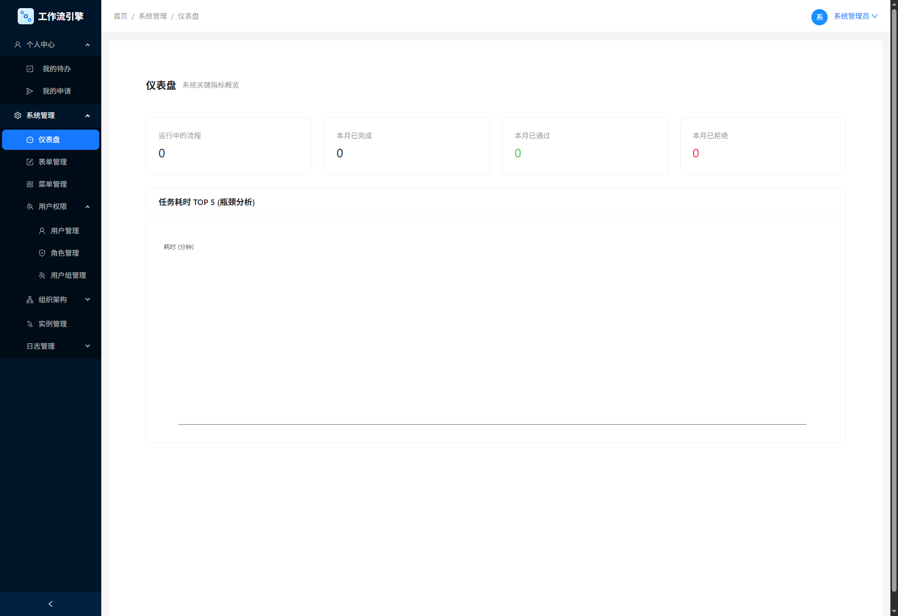
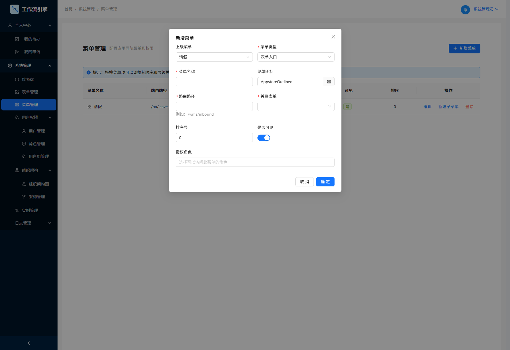
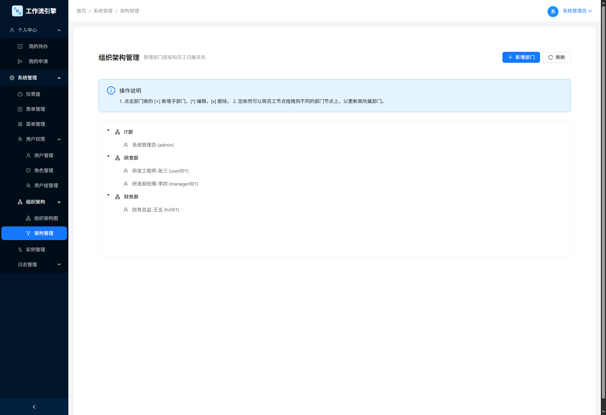
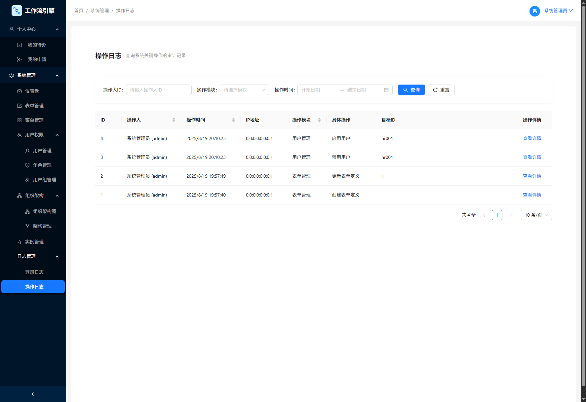

# 表单工作流引擎 (Form Workflow Engine)

[](https://opensource.org/licenses/MIT)
[](https://spring.io/projects/spring-boot)
[](https://vuejs.org/)
[](https://camunda.com/)

**一个功能强大且高度可扩展的低代码平台，旨在通过可视化的方式，让业务人员也能轻松构建、部署和管理复杂的业务流程。**

本项目深度整合了 **可视化表单设计器** 和 **BPMN 2.0 流程设计器**
，实现了从数据结构定义、用户交互界面创建到业务流程编排的全链路可视化配置。它不仅仅是一个工作流引擎，更是一个能够快速响应业务变化的敏捷开发平台。

## ✨ 核心特性

- **🚀 可视化表单设计器**:
    - **拖拽式布局**: 通过拖拽组件（如输入框、选择器、布局容器等）即可构建复杂的表单界面。
    - **丰富的组件库**: 内置20多种常用组件，包括布局（栅格、折叠面板）、基础（文本、日期、下拉框）、高级（文件上传、富文本、子表单、数据选择器、人员选择器）等。
    - **动态数据源**: 下拉框、树形选择器等组件支持配置静态数据或通过API动态获取。
    - **JSON Schema 驱动**: 所有表单定义最终生成并存储为JSON格式，易于扩展和迁移。
    - **Word文档一键导入**: 支持上传 `.docx` 格式的文档，系统能智能解析表格和文本，自动生成表单，极大提升表单创建效率。

- **🎨 BPMN 2.0 流程设计器**:
    - **Web端可视化建模**: 集成强大的 `bpmn-js` 库，提供符合 BPMN 2.0 规范的在线流程设计体验。
    - **深度集成 Camunda**: 完美支持 Camunda 的属性配置，如处理人、候选组、监听器、代理表达式等。
    - **完全汉化**: 对设计器界面及属性面板进行了全面的中文本地化，提升国内用户体验。
    - **一键部署**: 在设计器中完成流程绘制后，可一键将BPMN模型部署到后端Camunda引擎。

- **🔑 动态菜单与精细化权限控制**:
    - **菜单动态生成**: 系统侧边栏菜单完全由后端根据用户角色动态生成，实现千人千面。
    - **RBAC权限模型**: 基于“用户-角色-菜单”的经典权限模型，轻松控制不同角色对不同功能的访问权限。
    - **数据范围控制 (Data Scope)**: 独创的数据权限控制机制，可为每个“数据列表”类型的菜单配置不同的数据可见范围（如：*
      *仅本人、按部门、按用户组、全部数据**），实现精细化的数据隔离。

- **📊 灵活的动态数据视图**:
    - **通用数据列表**: 提供一个高度复用的数据列表组件 (`DataListView.vue`)，可根据任何表单的配置，动态生成筛选条件和表格列。
    - **无代码配置**: 只需在表单设计器中勾选“用作列表筛选”和“在列表中显示”，即可自动生成功能完善的数据查询和展示页面。

- **🏢 完善的后台管理功能**:
    - **组织架构管理**: 支持可视化的部门层级管理，可通过拖拽方式调整员工所属部门。
    - **用户/角色/用户组管理**: 提供完整的用户、角色、用户组的增删改查功能。
    - **流程实例监控**: 实时查看运行中、已挂起、已结束的流程实例，并可进行 **挂起、激活、终止、转办** 等管理操作。
    - **审计日志**: 内置详细的 **登录日志** 和 **操作日志**，所有关键操作均有据可查，满足合规性要求。

- **⚙️ 健全的系统功能**:
    - **JWT认证**: 使用基于JWT的无状态认证机制，安全可靠。
    - **文件管理**: 支持多文件上传，并与业务表单深度绑定。内置定时任务，可自动清理未关联的临时文件，防止数据不一致。
    - **消息通知**: 通过异步任务，在流程流转到下一节点时，自动向审批人发送邮件通知。
    - **系统仪表盘**: 提供关键指标的可视化概览，如运行中流程数、任务耗时排行等，帮助管理者洞察系统状态。
    - **全局异常处理**: 统一的后端异常处理机制，为前端提供结构化、友好的错误提示。

## 📸 项目截图

| **仪表盘 (Dashboard)**                  | **表单设计器 (Form Builder)**           |
| :-------------------------------------: | :-------------------------------------: |
|  |  |
| **流程设计器 (Workflow Designer)**      | **菜单管理 (Menu Management)**          |
| :-------------------------------------: | :-------------------------------------: |
|  |  |
| **组织架构管理 (Org Management)**       | **操作日志管理 (Logs Management)**      |
| :-------------------------------------: | :-------------------------------------: |
|  |  |

## 🛠️ 技术栈

<div style="display: flex; gap: 20px;">
<div style="width: 50%;">
  <h4>后端技术</h4>
  <ul>
    <li><b>核心框架:</b> Spring Boot 3</li>
    <li><b>工作流引擎:</b> Camunda 7</li>
    <li><b>安全认证:</b> Spring Security 6, JWT</li>
    <li><b>数据库:</b> Spring Data JPA (Hibernate), H2 (演示)</li>
    <li><b>异步任务:</b> Spring @Async, @Scheduled</li>
    <li><b>邮件服务:</b> Spring Mail</li>
    <li><b>日志切面:</b> Spring AOP</li>
    <li><b>构建工具:</b> Maven</li>
  </ul>
</div>
<div style="width: 50%;">
  <h4>前端技术</h4>
  <ul>
    <li><b>核心框架:</b> Vue 3 (Composition API)</li>
    <li><b>构建工具:</b> Vite</li>
    <li><b>UI 框架:</b> Ant Design Vue 4.x</li>
    <li><b>状态管理:</b> Pinia</li>
    <li><b>路由:</b> Vue Router 4</li>
    <li><b>HTTP 请求:</b> Axios</li>
    <li><b>BPMN 设计器:</b> bpmn-js, bpmn-js-properties-panel</li>
    <li><b>富文本编辑器:</b> QuillEditor</li>
    <li><b>图表库:</b> ECharts</li>
  </ul>
</div>
</div>

## 🚀 快速开始

### 环境准备

- JDK 17+
- Maven 3.6+
- Node.js 18+
- MySQL (可选，如需替换H2数据库)

### 后端启动

1. 克隆仓库：
   ```bash
   git clone https://github.com/git-hub-cc/Workflow.git
   ```

2. 进入后端项目目录：
   ```bash
   cd Workflow/workflow-java
   ```

3. 使用 Maven 构建项目：
   ```bash
   mvn clean install
   ```

4. 运行 Spring Boot 应用：
   ```bash
   java -jar target/workflow-0.0.1-SNAPSHOT.jar
   ```

5. 后端服务将启动在 `http://localhost:8080`。首次启动时，会自动创建H2数据库并初始化演示数据。

> **注意**: 默认使用H2内存数据库。如需连接MySQL，请修改 `src/main/resources/application.properties` 文件中的数据源配置。

### 前端启动

1. 进入前端项目目录：
   ```bash
   cd Workflow/workflow-ui
   ```

2. 安装依赖：
   ```bash
   npm install
   ```

3. 启动开发服务器：
   ```bash
   npm run dev
   ```

4. 前端服务将启动在 `http://localhost:5173`。`vite.config.js` 中已配置好代理，所有 `/api` 请求会自动转发到后端服务。

### 访问系统

- 打开浏览器并访问: `http://localhost:5173`
- 使用以下演示账户登录：
    - **系统管理员**: `admin` / `admin`
    - **普通员工 (张三)**: `user001` / `password`
    - **研发部经理 (李四)**: `manager001` / `password`
    - **财务总监 (王五)**: `hr001` / `password`

> **提示**: 管理员创建的新用户或被重置密码的用户，默认密码均为 `password`，首次登录时系统会强制要求修改密码。

## 📁 项目结构

```
Workflow
├── workflow-java/         # 后端 Spring Boot 项目
│   ├── src/main/java
│   │   ├── aop/           # AOP 切面 (操作日志)
│   │   ├── config/        # Spring Security, JWT 配置
│   │   ├── controller/    # RESTful API 控制器
│   │   ├── domain/        # JPA 实体类
│   │   ├── dto/           # 数据传输对象
│   │   ├── exception/     # 全局异常处理
│   │   ├── listener/      # 事件监听器 (如登录失败)
│   │   ├── repository/    # Spring Data JPA 仓库
│   │   └── service/       # 业务逻辑服务
│   └── src/main/resources
│       └── application.properties # 配置文件
│
└── workflow-ui/           # 前端 Vue 项目
    ├── public/            # 公共静态资源
    └── src/
        ├── api/           # API 请求封装
        ├── assets/        # 样式和静态资源
        ├── components/    # 全局可复用组件
        ├── composables/   # Vue Composition API hooks
        ├── router/        # 路由配置 (含动态路由)
        ├── stores/        # Pinia 状态管理
        ├── utils/         # 工具函数 (BPMN汉化, 图标库等)
        └── views/         # 页面级组件
            ├── admin/     # 管理员后台页面
            ├── builder-components/ # 表单设计器组件
            └── viewer-components/  # 表单渲染器组件
```

## 📜 开源许可

本项目基于 [MIT License](https://opensource.org/licenses/MIT) 开源。